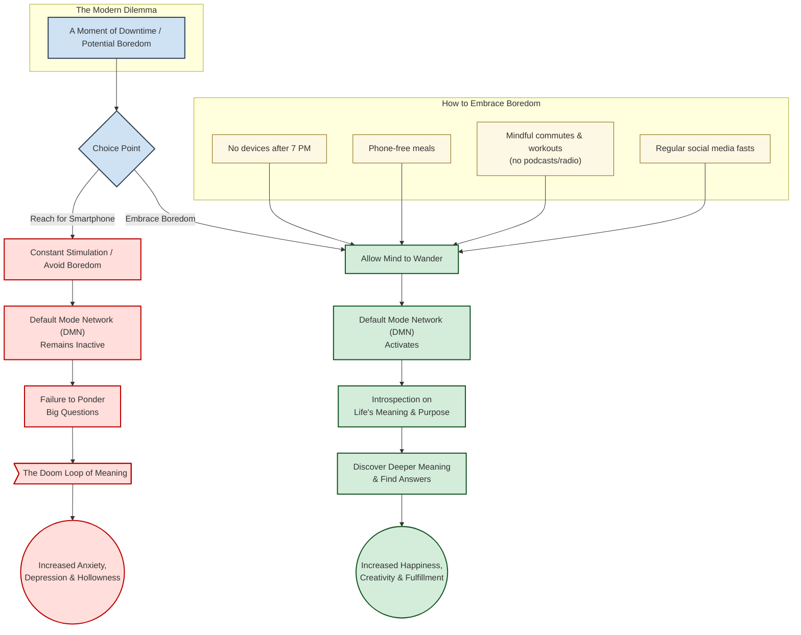

```mermaid
graph TD
    subgraph "The Modern Dilemma"
        A[A Moment of Downtime / Potential Boredom]
    end

    A --> B{Choice Point}

    %% The Negative Path: Avoiding Boredom
    B -- "Reach for Smartphone" --> C[Constant Stimulation / Avoid Boredom]
    C --> D["Default Mode Network (DMN)<br>Remains Inactive"]
    D --> E[Failure to Ponder<br>Big Questions]
    E --> F>"The Doom Loop of Meaning"]
    F --> G((Increased Anxiety,<br>Depression & Hollowness))

    %% The Positive Path: Embracing Boredom
    B -- "Embrace Boredom" --> H[Allow Mind to Wander]
    H --> I["Default Mode Network (DMN)<br>Activates"]
    I --> J[Introspection on<br>Life's Meaning & Purpose]
    J --> K[Discover Deeper Meaning<br>& Find Answers]
    K --> L((Increased Happiness,<br>Creativity & Fulfillment))

    %% Practical Steps to Achieve the Positive Path
    subgraph "How to Embrace Boredom"
        P1["No devices after 7 PM"]
        P2["Phone-free meals"]
        P3["Mindful commutes & workouts<br>(no podcasts/radio)"]
        P4["Regular social media fasts"]
    end
    
    %% Link recommendations to the positive action
    P1 & P2 & P3 & P4 --> H

    %% Styling for Clarity
    classDef negative fill:#ffdedb,stroke:#b00,stroke-width:2px;
    classDef positive fill:#d4edda,stroke:#155724,stroke-width:2px;
    classDef recommendation fill:#fcf8e3,stroke:#856404,stroke-width:1px;
    classDef choice fill:#cfe2f3,stroke:#345,stroke-width:2px;

    class C,D,E,F,G negative;
    class H,I,J,K,L positive;
    class P1,P2,P3,P4 recommendation;
    class A,B choice;
```
