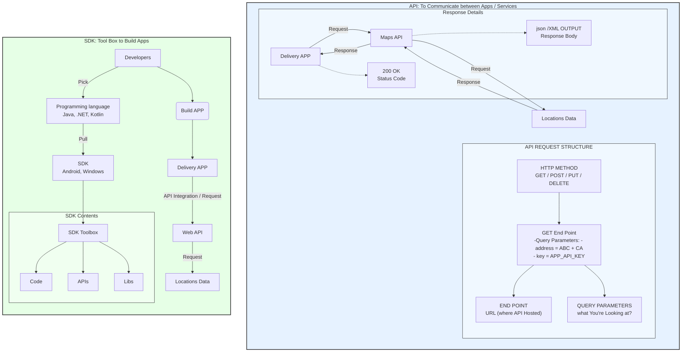

```mermaid
graph TD
    subgraph API [API: To Communicate between Apps / Services]
        direction LR
        subgraph api_request [API REQUEST STRUCTURE]
            A[HTTP METHOD<br>GET / POST / PUT / DELETE] --> B["GET End Point<br>-Query Parameters: - address = ABC + CA<br>- key = APP_API_KEY"];
            B --> C["END POINT<br>URL (where API Hosted)"];
            B --> D[QUERY PARAMETERS<br>what You're Looking at?];
        end

        DeliveryApp_API[Delivery APP] -- Request --> MapsAPI[Maps API];
        MapsAPI -- Response --> DeliveryApp_API;
        MapsAPI -- Request --> LocationsData[Locations Data];
        LocationsData -- Response --> MapsAPI;

        subgraph response_details [Response Details]
            direction TB
            DeliveryApp_API -.-> StatusCode[200 OK<br>Status Code];
            MapsAPI -.-> ResponseBody[json /XML OUTPUT<br>Response Body];
        end

    end

    subgraph SDK [SDK: Tool Box to Build Apps]
        direction TB
        Developers -- Pick --> ProgLang[Programming language<br>Java, .NET, Kotlin];
        ProgLang -- Pull --> PlatformSDK[SDK<br>Android, Windows];

        subgraph sdk_contents [SDK Contents]
            direction LR
            Toolbox[SDK Toolbox] --> Code[Code];
            Toolbox --> APIs[APIs];
            Toolbox --> Libs[Libs];
        end
        PlatformSDK --> Toolbox;

        BuildApp(Build APP) --> DeliveryApp_SDK[Delivery APP];
        Developers --> BuildApp;

        DeliveryApp_SDK -- API Integration / Request --> WebAPI[Web API];
        WebAPI -- Request --> LocationsData_SDK[Locations Data];
    end

    style API fill:#e6f2ff,stroke:#333,stroke-width:2px
    style SDK fill:#e6ffe6,stroke:#333,stroke-width:2px
    style api_request fill:#f0f8ff,stroke:#333,stroke-width:1px
    style response_details fill:#f0f8ff,stroke:#333,stroke-width:1px
    style sdk_contents fill:#f0fff0,stroke:#333,stroke-width:1px
```
