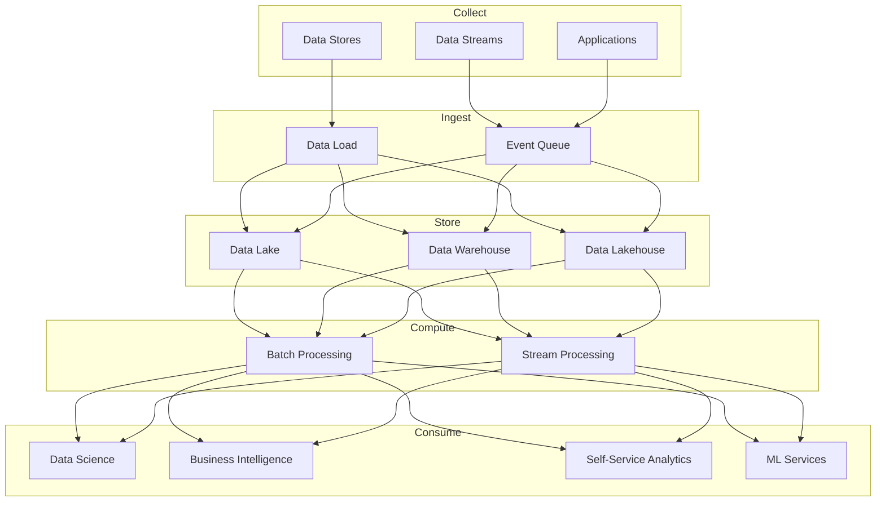

```mermaid
graph TD
    subgraph Collect
        A[Data Stores]
        B[Data Streams]
        C[Applications]
    end

    subgraph Ingest
        D[Data Load]
        E[Event Queue]
    end

    subgraph Store
        F[Data Lake]
        G[Data Warehouse]
        H[Data Lakehouse]
    end

    subgraph Compute
        I[Batch Processing]
        J[Stream Processing]
    end

    subgraph Consume
        K[Data Science]
        L[Business Intelligence]
        M[Self-Service Analytics]
        N[ML Services]
    end

    A --> D
    B --> E
    C --> E
    D --> F
    D --> G
    D --> H
    E --> F
    E --> G
    E --> H

    F --> I
    G --> I
    H --> I
    F --> J
    G --> J
    H --> J

    I --> K
    I --> L
    I --> M
    I --> N
    J --> K
    J --> L
    J --> M
    J --> N
```
