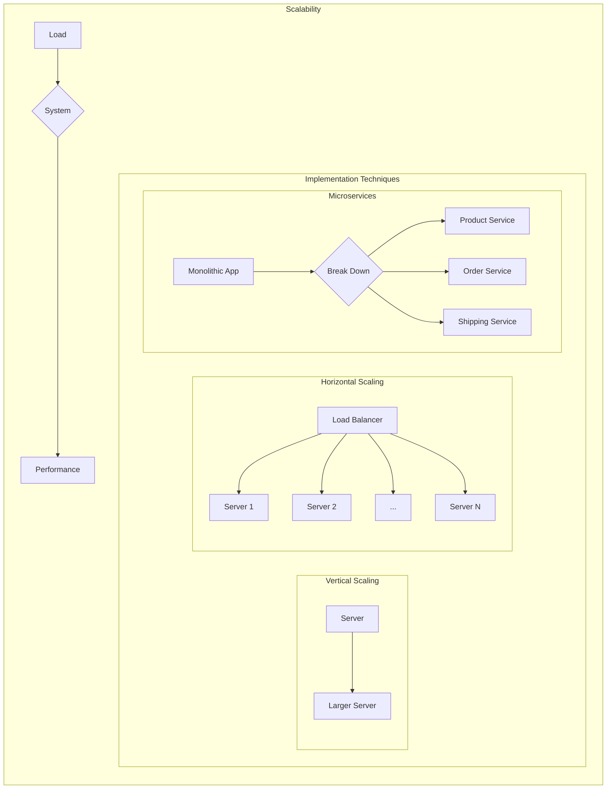
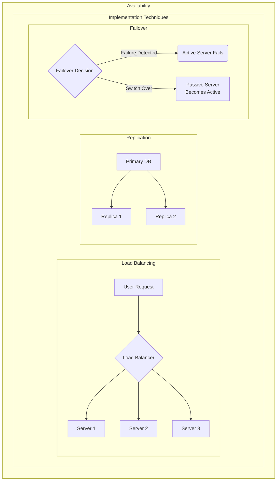
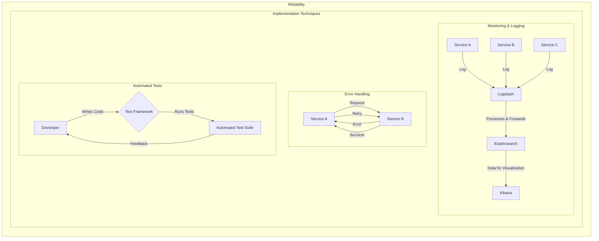
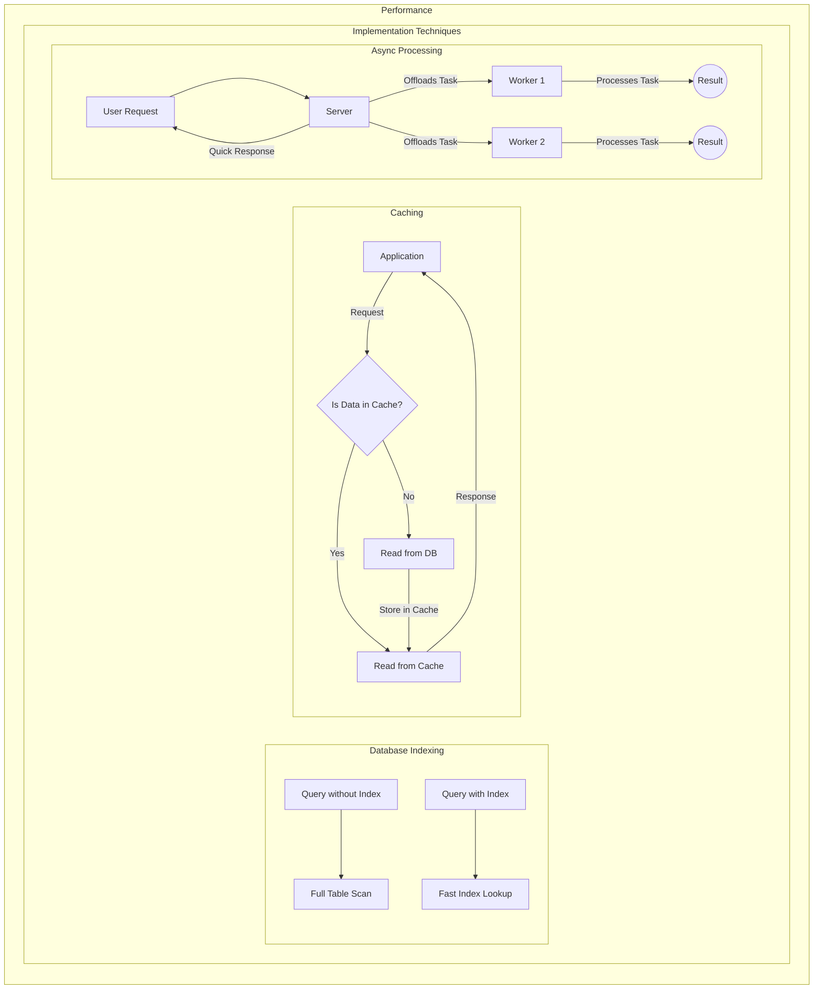

### Scalability

```mermaid
graph TD
    subgraph Scalability
        direction TB
        A[Load] --> B{System}
        B --> C[Performance]

        subgraph "Implementation Techniques"
            direction LR
            subgraph Vertical Scaling
                D[Server] --> E[Larger Server];
            end

            subgraph Horizontal Scaling
                LB[Load Balancer] --> S1[Server 1]
                LB --> S2[Server 2]
                LB --> S3[...]
                LB --> SN[Server N]
            end

            subgraph Microservices
                K[Monolithic App] --> L{Break Down};
                L --> M[Product Service];
                L --> N[Order Service];
                L --> O[Shipping Service];
            end
        end
    end
```

### Availability

```mermaid
graph TD
    subgraph Availability
        direction TB

        subgraph "Implementation Techniques"
            direction LR
            subgraph Load Balancing
                A[User Request] --> B{Load Balancer};
                B --> C[Server 1];
                B --> D[Server 2];
                B --> E[Server 3];
            end

            subgraph Replication
                F[Primary DB] --> G[Replica 1];
                F --> H[Replica 2];
            end

            subgraph Failover
                I{Failover Decision} -- Failure Detected --> J(Active Server Fails);
                I -- Switch Over --> K[Passive Server <br> Becomes Active];
            end
        end
    end
```

### Reliability

```mermaid
graph TB
    subgraph Reliability
        direction TB

        subgraph "Implementation Techniques"
            direction TB
            subgraph "Monitoring & Logging"
                direction TB
                A[Service A] -- Log --> D[Logstash];
                B[Service B] -- Log --> D;
                C[Service C] -- Log --> D;
                D -- Processes & Forwards --> E[Elasticsearch];
                E -- Data for Visualization --> F[Kibana];
            end

            subgraph Error Handling
                G[Service A] -- Request --> H[Service B];
                H -- Error --> G;
                G -- Retry --> H;
                H -- Success --> G;
            end

            subgraph Automated Tests
               I[Developer] -- Writes Code --> J{Test Framework};
               J -- Runs Tests --> K[Automated Test Suite];
               K -- Feedback --> I;
            end
        end
    end
```

### Performance

```mermaid
graph TD
    subgraph Performance
        direction TB

        subgraph "Implementation Techniques"
            direction LR
            subgraph Database Indexing
                A[Query without Index] --> B[Full Table Scan];
                C[Query with Index] --> D[Fast Index Lookup];
            end

            subgraph Caching
                E[Application] -- Request --> F{Is Data in Cache?};
                F -- Yes --> G[Read from Cache];
                F -- No --> H[Read from DB];
                H -- Store in Cache --> G;
                G -- Response --> E;
            end

            subgraph "Async Processing"
                I[User Request] --> J[Server];
                J -- Quick Response --> I;
                J -- Offloads Task --> K[Worker 1];
                J -- Offloads Task --> L[Worker 2];
                K -- Processes Task --> M((Result));
                L -- Processes Task --> N((Result));
            end
        end
    end
```
