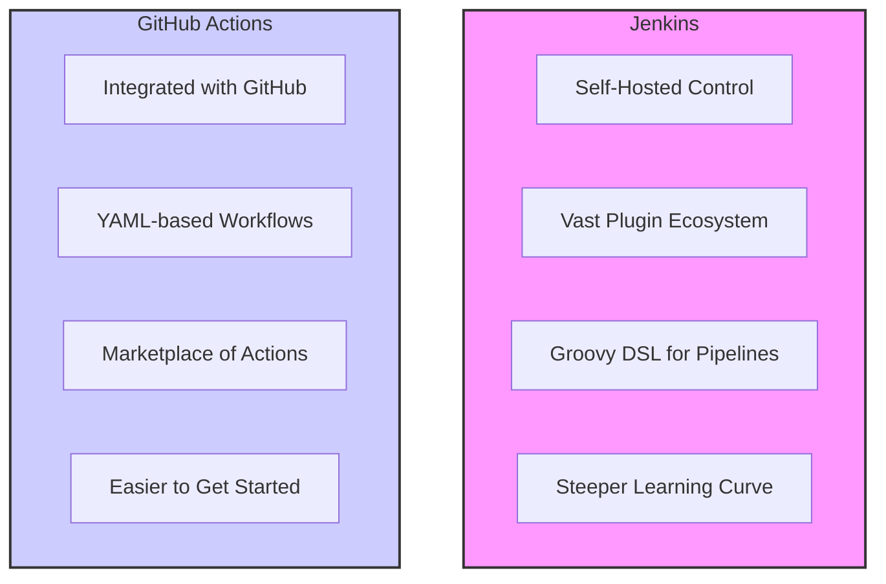
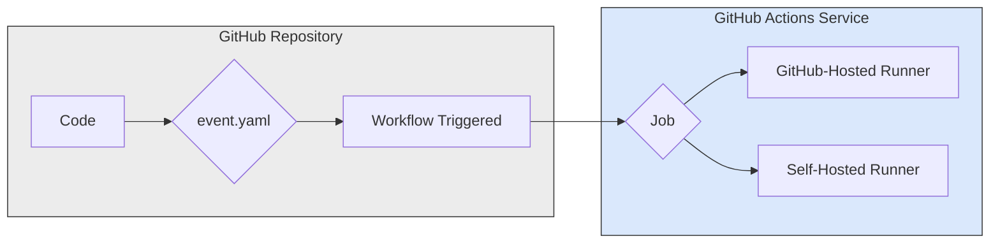
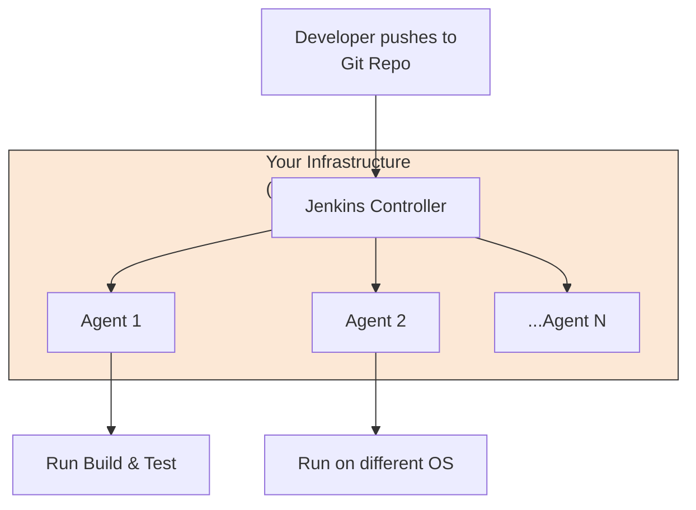
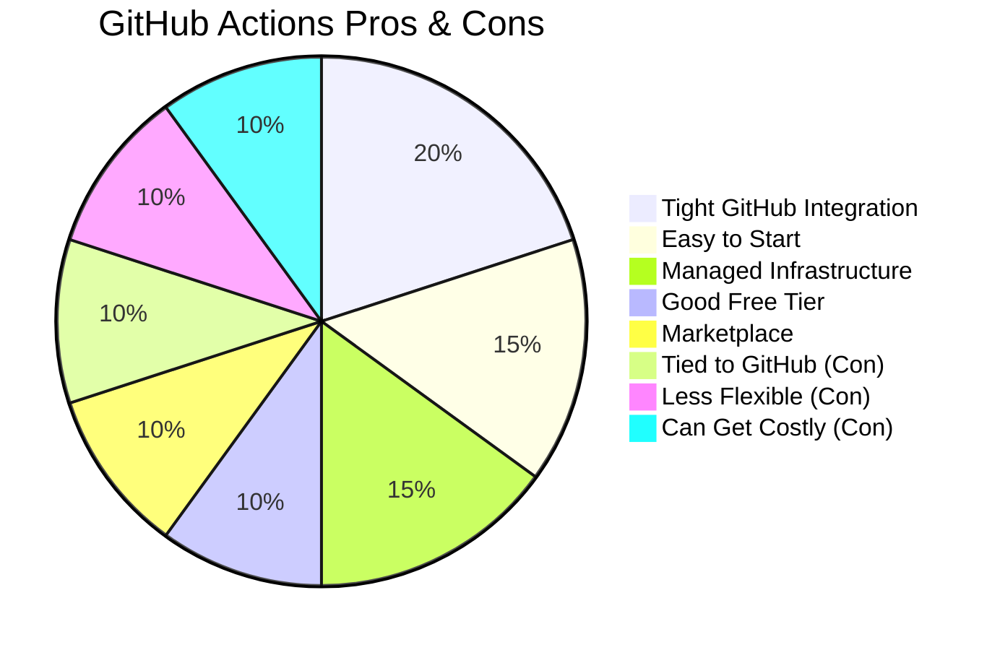
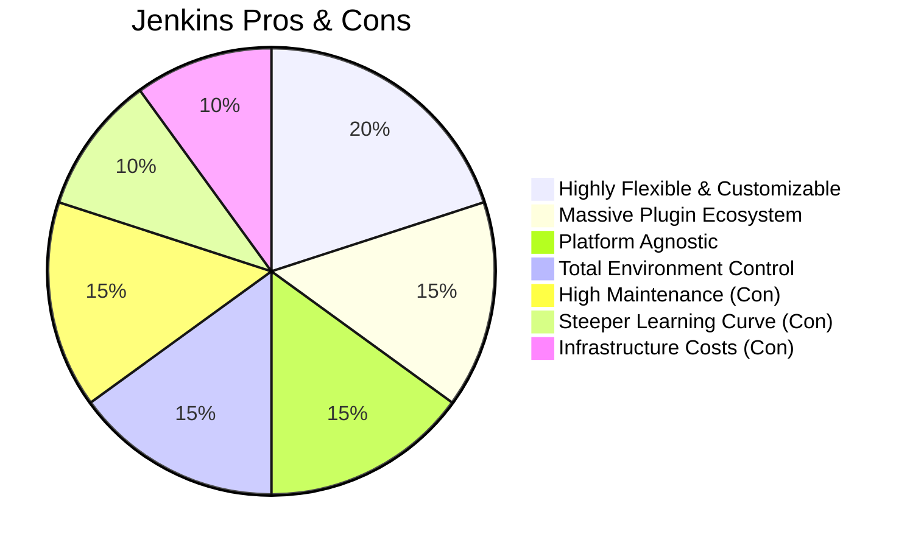

### Core Differences

```mermaid
graph TD
    subgraph Jenkins
        direction LR
        A[Self-Hosted Control];
        B[Vast Plugin Ecosystem];
        C[Groovy DSL for Pipelines];
        D[Steeper Learning Curve];
    end

    subgraph GHR [GitHub Actions]
        direction LR
        E[Integrated with GitHub];
        F[YAML-based Workflows];
        G[Marketplace of Actions];
        H[Easier to Get Started];
    end

    style Jenkins fill:#f9f,stroke:#333,stroke-width:2px
    style GHR fill:#ccf,stroke:#333,stroke-width:2px
```

### GitHub Actions Architecture

```mermaid
graph LR
    subgraph GHR [GitHub Repository]
        direction LR
        A[Code] --> B{event.yaml};
        B --> C[Workflow Triggered];
    end

    subgraph GHAS [GitHub Actions Service]
        direction TB
        C --> D{Job};
        D --> E[GitHub-Hosted Runner];
        D --> F[Self-Hosted Runner];
    end

    style GHR fill:#ececec,stroke:#333
    style GHAS fill:#dae8fc,stroke:#333
```

### Jenkins Architecture

```mermaid
graph TD
    subgraph YI ["Your Infrastructure<br/>(On-Prem or Cloud)"]
        A[Jenkins Controller] --> B[Agent 1];
        A --> C[Agent 2];
        A --> D[...Agent N];
    end

    E[Developer pushes to<br/>Git Repo] --> A;
    B --> F[Run Build & Test];
    C --> G[Run on different OS];

    style YI fill:#fce8d6,stroke:#333
```

### GitHub Actions Pros & Cons

```mermaid
pie
    title GitHub Actions Pros & Cons
    "Tight GitHub Integration" : 20
    "Easy to Start" : 15
    "Managed Infrastructure" : 15
    "Good Free Tier" : 10
    "Marketplace" : 10
    "Tied to GitHub (Con)" : 10
    "Less Flexible (Con)" : 10
    "Can Get Costly (Con)" : 10
```

### Jenkins Pros & Cons

```mermaid
pie
    title Jenkins Pros & Cons
    "Highly Flexible & Customizable" : 20
    "Massive Plugin Ecosystem" : 15
    "Platform Agnostic" : 15
    "Total Environment Control" : 15
    "High Maintenance (Con)" : 15
    "Steeper Learning Curve (Con)" : 10
    "Infrastructure Costs (Con)" : 10
```
