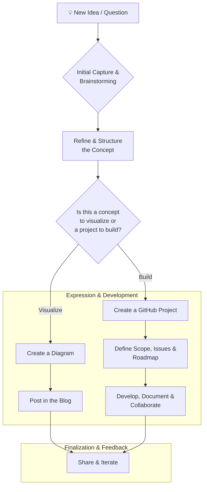

```mermaid
graph TD
    A[💡 New Idea / Question] --> B{Initial Capture &</br>Brainstorming};
    B --> C[Refine & Structure</br>the Concept];
    C --> D{Is this a concept</br>to visualize or</br>a project to build?};

    D -- "Visualize" --> E[Create a Diagram];
    E --> F[Post in the Blog];
    F --> G[Share & Iterate];


    D -- "Build" --> H[Create a GitHub Project];
    H --> I[Define Scope, Issues &</br>Roadmap];
    I --> J[Develop, Document &</br>Collaborate];
    J --> G;

    subgraph "Expression & Development"
        E
        F
        H
        I
        J
    end

    subgraph "Finalization & Feedback"
        G
    end
```
