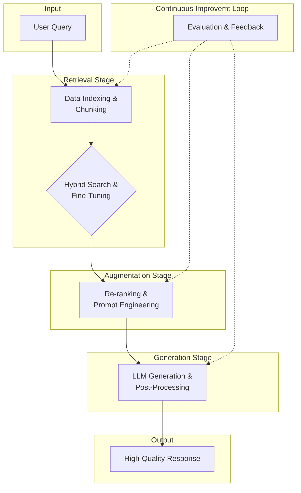
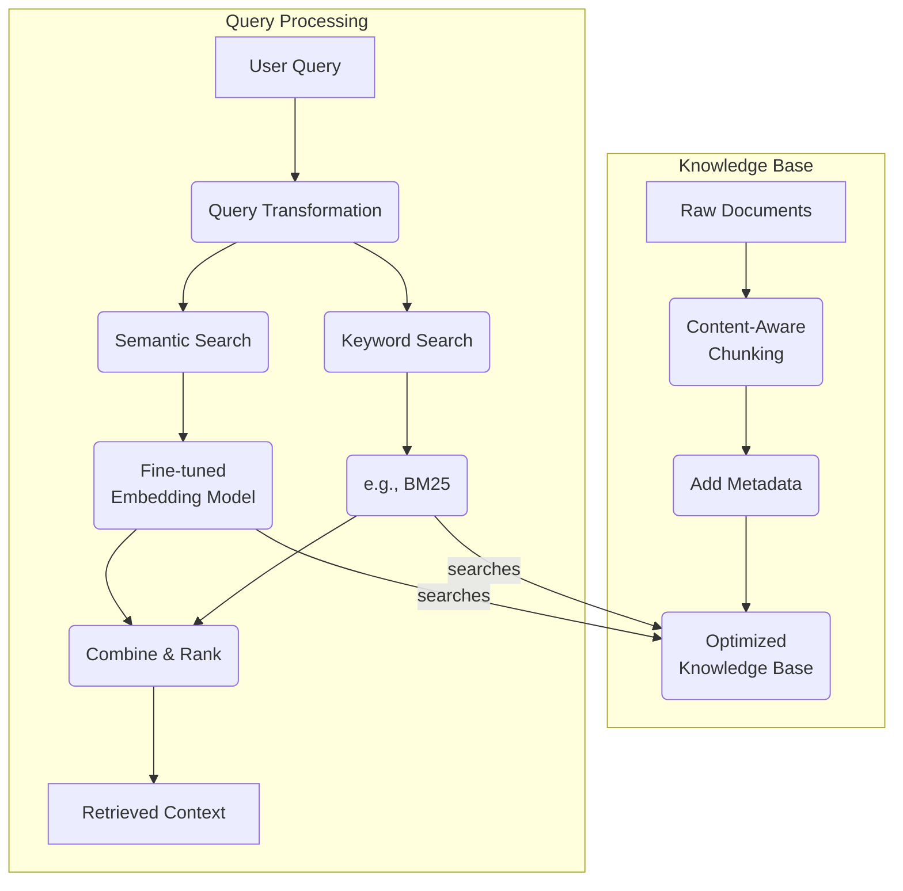
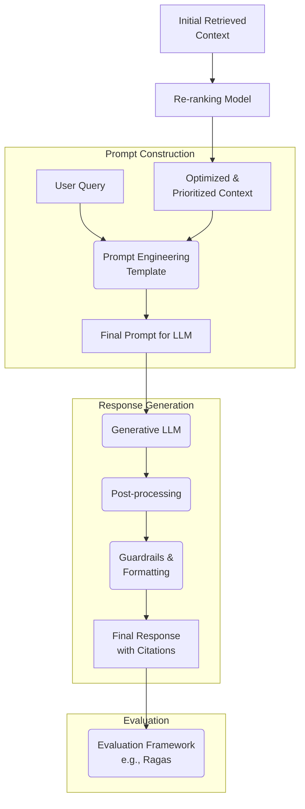

### High-Level Overview of RAG Optimization

```mermaid
graph TD
    subgraph "Input"
        Query[User Query]
    end

    subgraph "Retrieval Stage"
        Chunking["Data Indexing & <br> Chunking"] --> Search{"Hybrid Search & <br> Fine-Tuning"}
    end

    subgraph "Augmentation Stage"
        Augment["Re-ranking & <br> Prompt Engineering"]
    end

    subgraph "Generation Stage"
        Generate["LLM Generation & <br> Post-Processing"]
    end
    
    subgraph "Output"
        Response[High-Quality Response]
    end

    subgraph "Continuous Improvemt Loop"
        Feedback["Evaluation & Feedback"]
    end

    %% --- Define the Flow ---
    Query --> Chunking
    Search --> Augment
    Augment --> Generate
    Generate --> Response

    %% --- Define the Feedback Loop ---
    Feedback -.-> Chunking
    Feedback -.-> Augment
    Feedback -.-> Generate
```

### Improving the quality and accuracy of the Retrieval Stage

```mermaid
graph TD
    subgraph "Knowledge Base <br> Preparation"
        KB1[Raw Documents] --> KB2("Content-Aware<br>Chunking");
        KB2 --> KB3(Add Metadata);
        KB3 --> KB4("Optimized<br>Knowledge Base");
    end

    subgraph "Query Processing <br> and Search"
        Q1[User Query] --> Q2(Query Transformation);
        
        Q2 --> S1(Semantic Search);
        S1 --> E1("Fine-tuned<br>Embedding Model");

        Q2 --> S2(Keyword Search);
        S2 --> E2(e.g., BM25);

        E1 --> R1(Combine & Rank);
        E2 --> R1;

        R1 --> R2[Retrieved Context];
    end

    %% --- Connections to Knowledge Base ---
    E1 -- searches --> KB4;
    E2 -- searches --> KB4;
```

### Improving the quality and accuracy of the Augmentation & Generation

```mermaid
graph TD
    A["Initial Retrieved<br>Context"] --> B[Re-ranking Model];
    B --> C["Optimized &<br>Prioritized Context"];
    
    subgraph "Prompt Construction"
      U[User Query] --> P;
      C --> P("Prompt Engineering<br>Template");
      P --> F[Final Prompt for LLM];
    end

    subgraph "Response Generation"
        F --> LLM(Generative LLM);
        LLM --> Post(Post-processing);
        Post --> Guard("Guardrails &<br>Formatting");
        Guard --> Final["Final Response<br>with Citations"];
    end

    subgraph "Evaluation"
      Eval("Evaluation Framework<br>e.g., Ragas")
    end

    Final --> Eval
```
