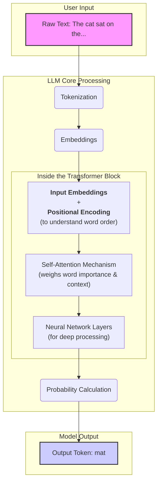
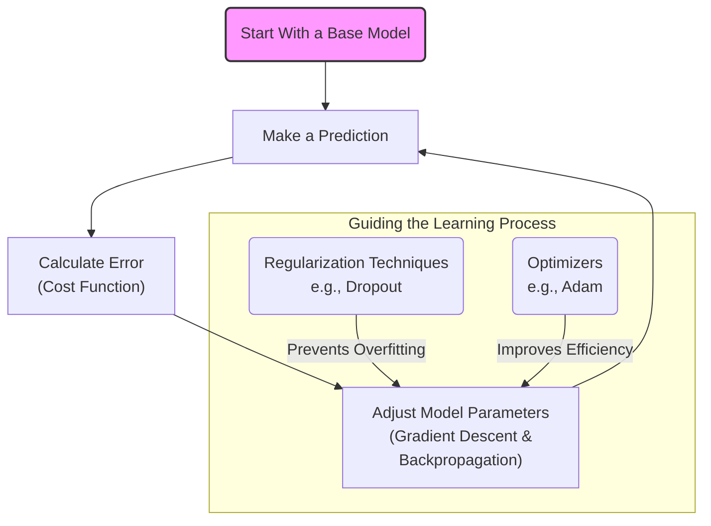
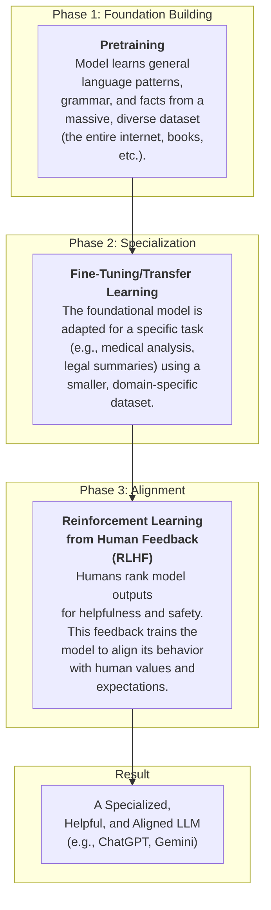
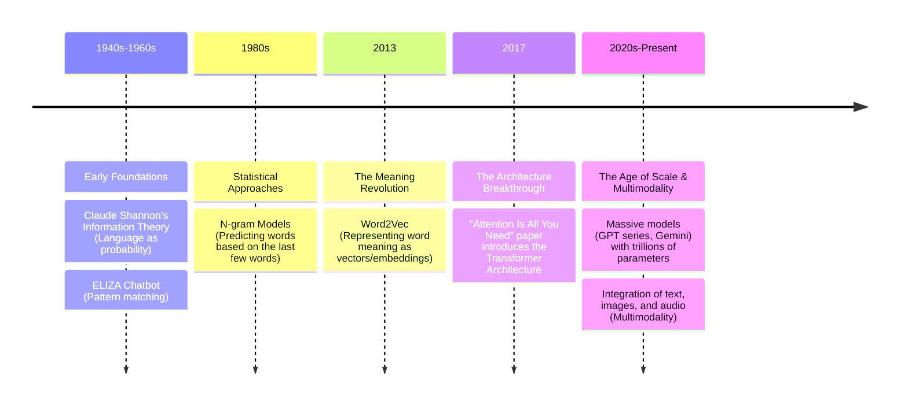

### The Core Process: How an LLM Generates Text

### The Learning Cycle: How an LLM Improves

### From General Knowledge to Aligned Specialist

### Timeline of Key Breakthroughs

Source: [Mathematics of LLMs in Everyday Language](https://www.youtube.com/watch?v=1WHaFWMMXLI)
