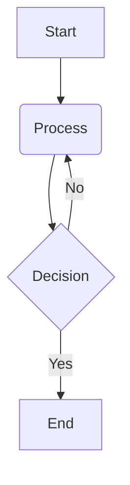

This post contains a Mermaid diagram. It should be rendered as an SVG, not as a plain code block.



This is a regular code block and should be highlighted as Python code.

```python
print("Hello, World!")
```

The diagram should appear above this final paragraph.
