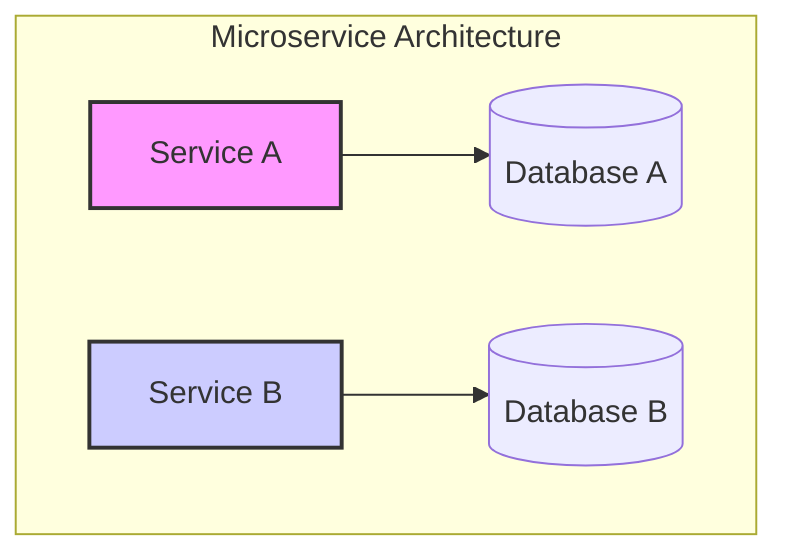
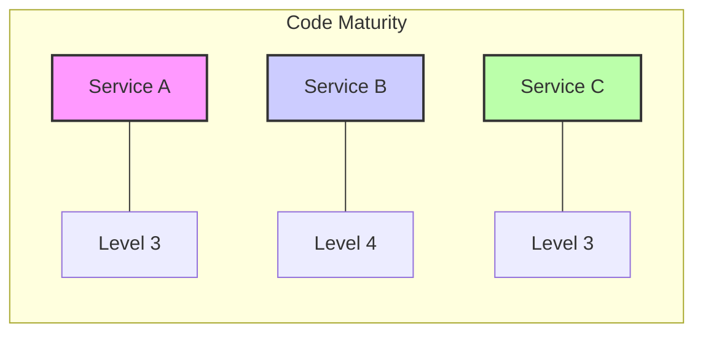
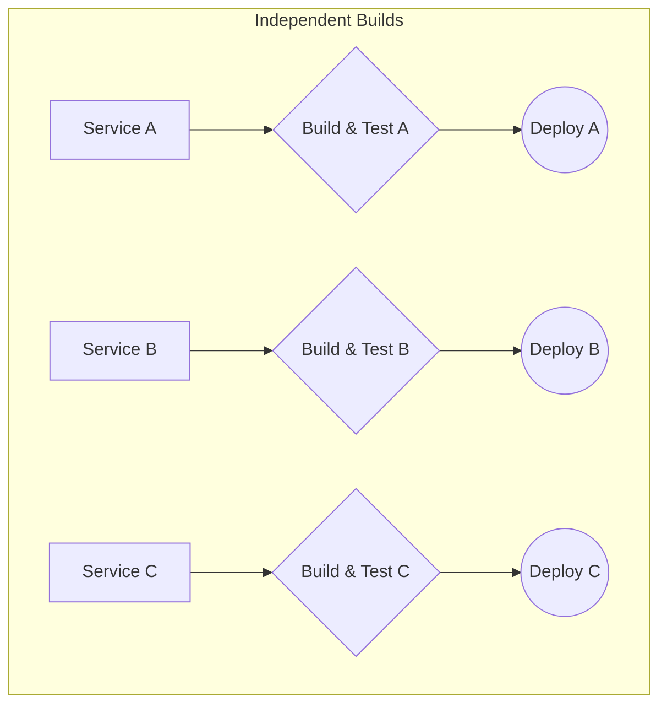
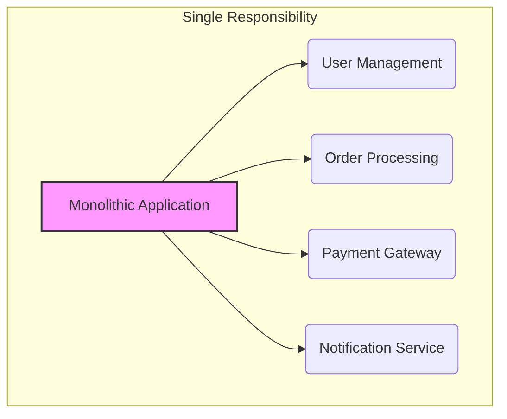
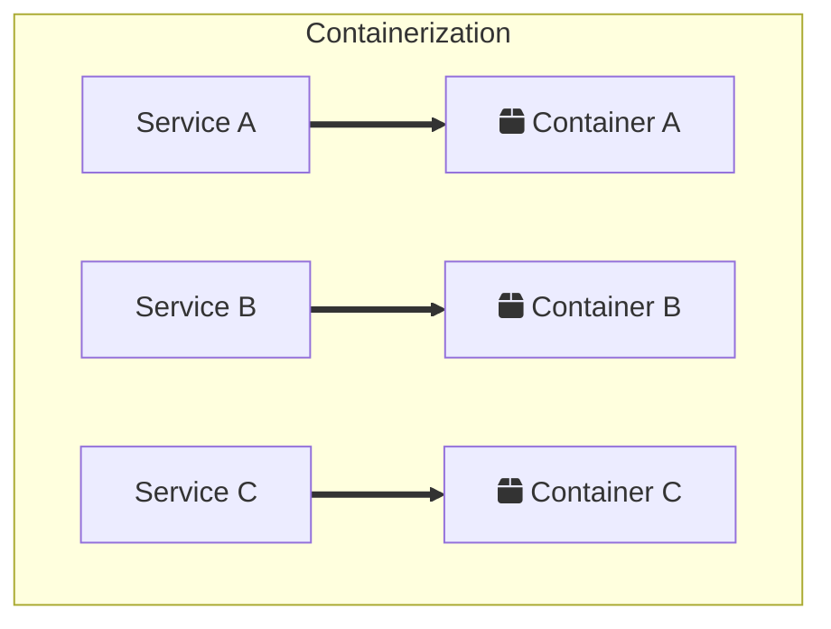
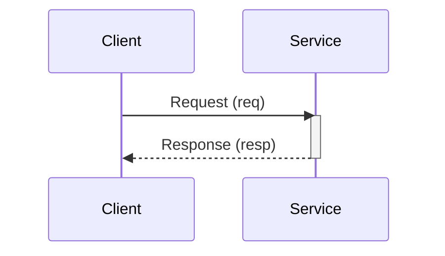
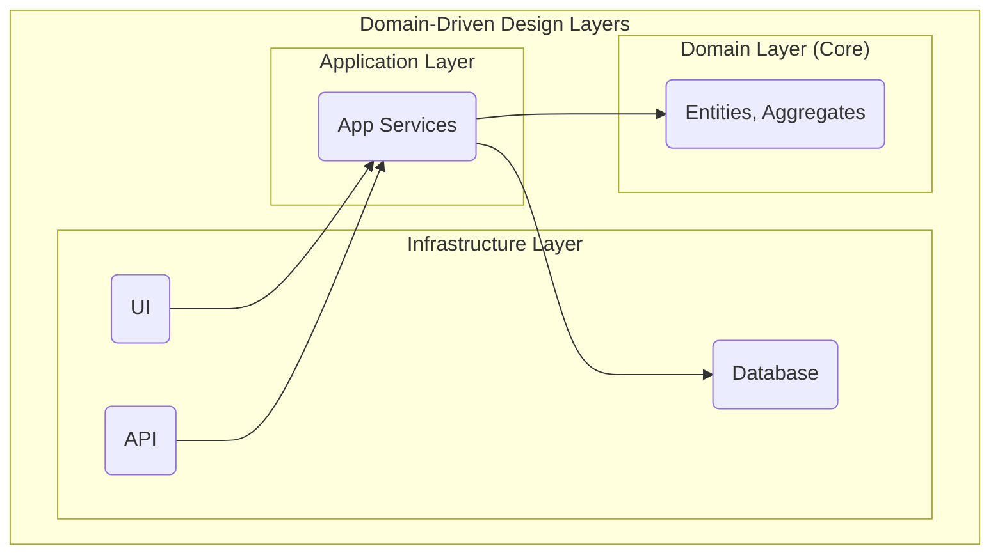
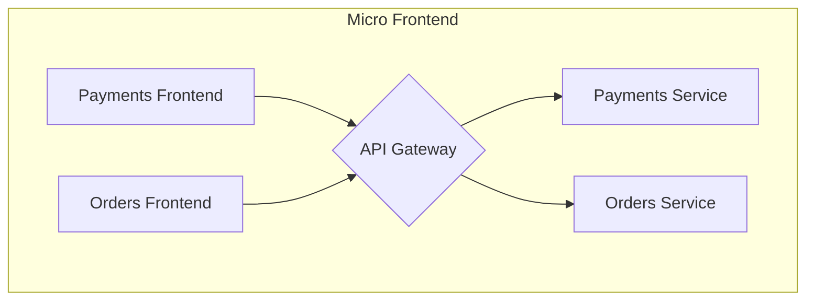
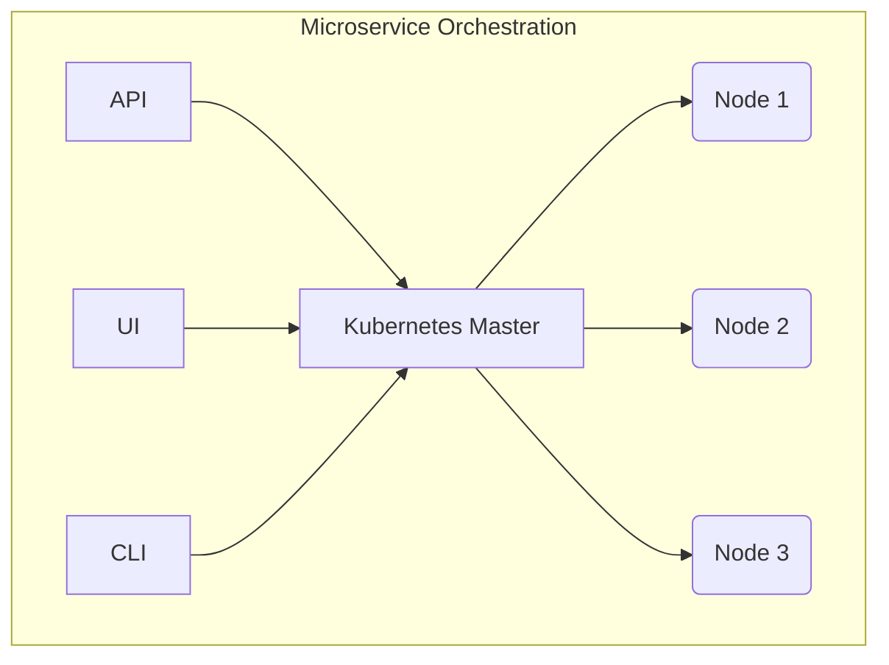

### 1. Separate Data Store

### 2. Keep Code at a Similar Level of Maturity

### 3. Separate Build for Each Microservice

### 4. Single Responsibility Principle

### 5. Deploy into Containers

### 6. Treat Servers as Stateless

### 7. Domain-Driven Design

### 8. Micro Frontend Architecture

### 9. Orchestrating Microservices

