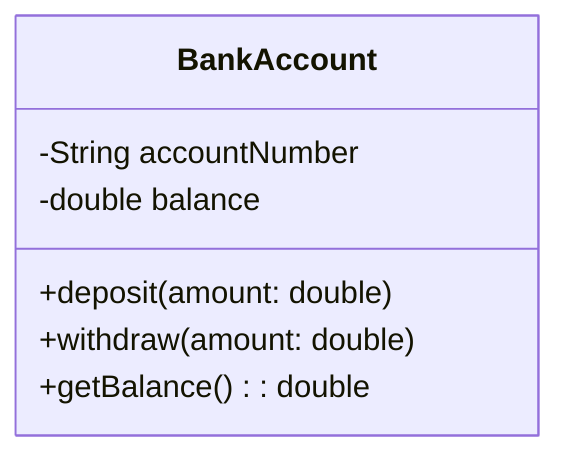
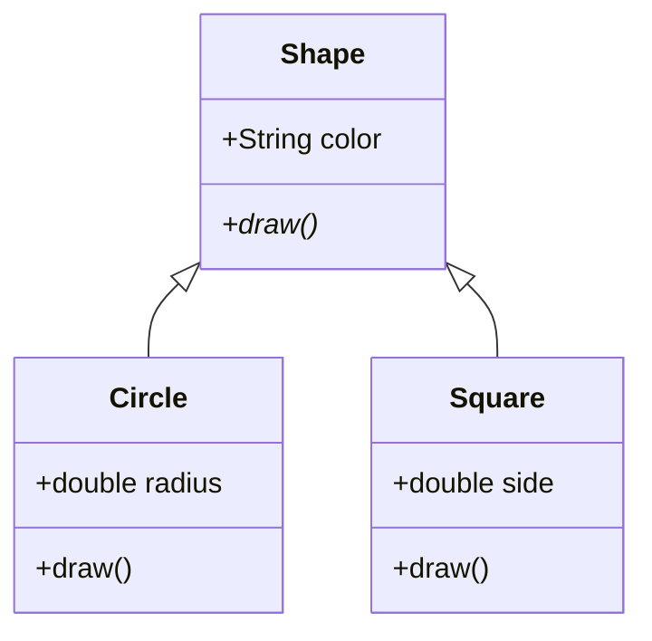
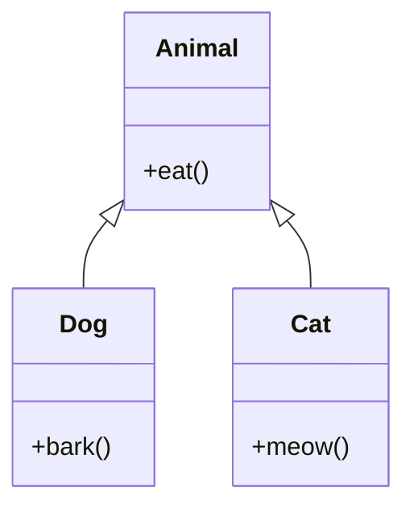
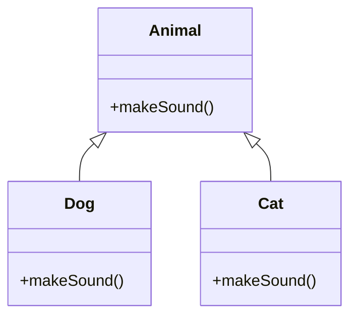

### Encapsulation

```mermaid
classDiagram
    class BankAccount {
        -String accountNumber
        -double balance
        +deposit(amount: double)
        +withdraw(amount: double)
        +getBalance(): double
    }
```

### Abstraction

```mermaid
classDiagram
    class Shape {
        +String color
        +draw()*
    }

    class Circle {
        +double radius
        +draw()
    }

    class Square {
        +double side
        +draw()
    }

    Shape <|-- Circle
    Shape <|-- Square
```

### Inheritance

```mermaid
classDiagram
    class Animal {
        +eat()
    }

    class Dog {
        +bark()
    }

    class Cat {
        +meow()
    }

    Animal <|-- Dog
    Animal <|-- Cat
```

### Polymorphism

```mermaid
classDiagram
    class Animal {
        +makeSound()
    }

    class Dog {
        +makeSound()
    }

    class Cat {
        +makeSound()
    }

    Animal <|-- Dog
    Animal <|-- Cat
```
