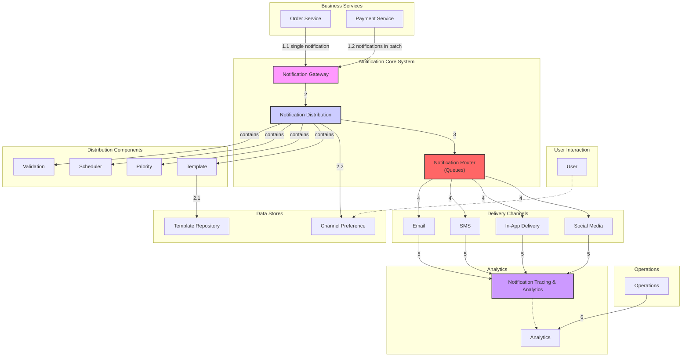

```mermaid
graph TD
    subgraph Business Services
        A[Order Service]
        B[Payment Service]
    end

    subgraph User Interaction
        U[User]
    end

    subgraph Operations
        O[Operations]
    end

    subgraph Notification Core System
        NG[Notification Gateway]
        ND[Notification Distribution]
        NR["Notification Router <br/> (Queues)"]
    end

    subgraph Distribution Components
        V[Validation]
        S[Scheduler]
        P[Priority]
        T[Template]
    end

    subgraph Data Stores
        CP[Channel Preference]
        TR[Template Repository]
    end

    subgraph Delivery Channels
        C1[Email]
        C2[SMS]
        C3[In-App Delivery]
        C4[Social Media]
    end

    subgraph Analytics
        NTA[Notification Tracing & Analytics]
        OA[Analytics]
    end

    A -- "1.1 single notification" --> NG
    B -- "1.2 notifications in batch" --> NG
    NG -- "2" --> ND
    ND -- contains --> V
    ND -- contains --> S
    ND -- contains --> P
    ND -- contains --> T
    T -- "2.1" --> TR
    ND -- "2.2" --> CP
    U -.-> CP
    ND -- "3" --> NR
    NR -- "4" --> C1
    NR -- "4" --> C2
    NR -- "4" --> C3
    NR -- "4" --> C4

    C1 -- "5" --> NTA
    C2 -- "5" --> NTA
    C3 -- "5" --> NTA
    C4 -- "5" --> NTA
    O -- "6" --> OA
    NTA -.-> OA

    style NG fill:#f9f,stroke:#333,stroke-width:2px
    style ND fill:#ccf,stroke:#333,stroke-width:2px
    style NR fill:#f66,stroke:#333,stroke-width:2px
    style NTA fill:#c9f,stroke:#333,stroke-width:2px
```
