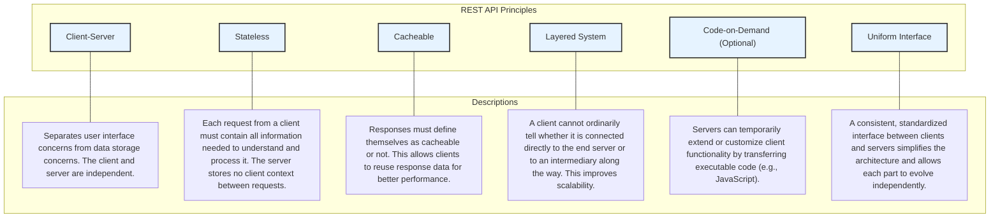
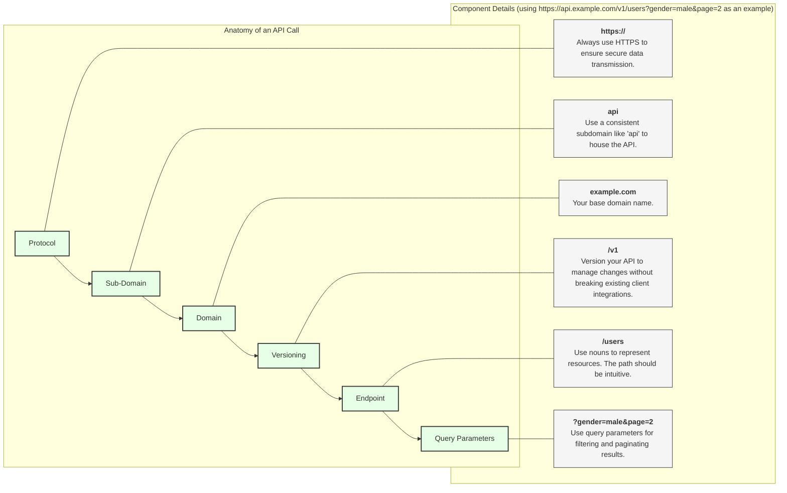
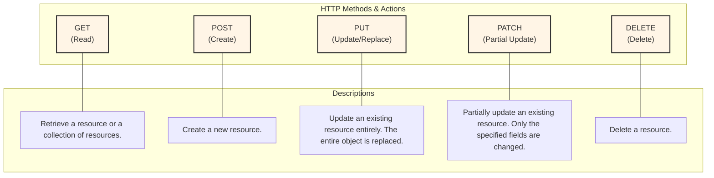

### The Six Core Principles of REST

```mermaid
graph TD
    subgraph REST API Principles
        A[Client-Server]
        B[Stateless]
        C[Cacheable]
        D[Layered System]
        E["Code-on-Demand (Optional)"]
        F[Uniform Interface]
    end

    subgraph Descriptions
        A_Desc["Separates user interface concerns from data storage concerns. The client and server are independent."]
        B_Desc["Each request from a client must contain all information needed to understand and process it. The server stores no client context between requests."]
        C_Desc["Responses must define themselves as cacheable or not. This allows clients to reuse response data for better performance."]
        D_Desc["A client cannot ordinarily tell whether it is connected directly to the end server or to an intermediary along the way. This improves scalability."]
        E_Desc["Servers can temporarily extend or customize client functionality by transferring executable code (e.g., JavaScript)."]
        F_Desc["A consistent, standardized interface between clients and servers simplifies the architecture and allows each part to evolve independently."]
    end

    A --- A_Desc
    B --- B_Desc
    C --- C_Desc
    D --- D_Desc
    E --- E_Desc
    F --- F_Desc

    classDef principles fill:#e6f3ff,stroke:#333,stroke-width:2px;
    class A,B,C,D,E,F principles;
```

### Anatomy of a REST API Endpoint

```mermaid
graph LR
    subgraph "Anatomy of an API Call"
        A[Protocol] --> B[Sub-Domain];
        B --> C["Domain"];
        C --> D[Versioning];
        D --> E[Endpoint];
        E --> F[Query Parameters];
    end

    subgraph "Component Details (using https://api.example.com/v1/users?gender=male&page=2 as an example)"
        A_Desc["<b>https://</b><br>Always use HTTPS to ensure secure data transmission."]
        B_Desc["<b>api</b><br>Use a consistent subdomain like 'api' to house the API."]
        C_Desc["<b>example.com</b><br>Your base domain name."]
        D_Desc["<b>/v1</b><br>Version your API to manage changes without breaking existing client integrations."]
        E_Desc["<b>/users</b><br>Use nouns to represent resources. The path should be intuitive."]
        F_Desc["<b>?gender=male&page=2</b><br>Use query parameters for filtering and paginating results."]
    end

    A --- A_Desc;
    B --- B_Desc;
    C --- C_Desc;
    D --- D_Desc;
    E --- E_Desc;
    F --- F_Desc;

    classDef parts fill:#e6ffe6,stroke:#333,stroke-width:2px;
    class A,B,C,D,E,F parts;

    classDef details fill:#f5f5f5,stroke:#333,stroke-width:1px;
    class A_Desc,B_Desc,C_Desc,D_Desc,E_Desc,F_Desc details;
```

### Common HTTP Methods

```mermaid
graph TD
    subgraph HTTP Methods & Actions
        GET["GET<br>(Read)"]
        POST["POST<br>(Create)"]
        PUT["PUT<br>(Update/Replace)"]
        PATCH["PATCH<br>(Partial Update)"]
        DELETE["DELETE<br>(Delete)"]
    end

    subgraph Descriptions
        GET_Desc["Retrieve a resource or a collection of resources."]
        POST_Desc["Create a new resource."]
        PUT_Desc["Update an existing resource entirely. The entire object is replaced."]
        PATCH_Desc["Partially update an existing resource. Only the specified fields are changed."]
        DELETE_Desc["Delete a resource."]
    end

    GET --- GET_Desc
    POST --- POST_Desc
    PUT --- PUT_Desc
    PATCH --- PATCH_Desc
    DELETE --- DELETE_Desc

    classDef methods fill:#fff5e6,stroke:#333,stroke-width:2px;
    class GET,POST,PUT,PATCH,DELETE methods;
```
