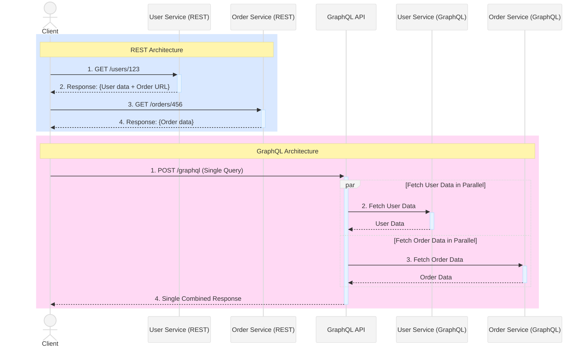

```mermaid
%%{init: {'theme': 'base', 'themeVariables': { 'primaryColor': '#F4F4F4', 'primaryTextColor': '#333', 'secondaryColor': '#E6F3FF', 'lineColor': '#444'}}}%%
sequenceDiagram
    actor Client
    participant REST_User as User Service (REST)
    participant REST_Order as Order Service (REST)
    participant GraphQL_API as GraphQL API
    participant GQL_User as User Service (GraphQL)
    participant GQL_Order as Order Service (GraphQL)

    # REST Architecture Section
    rect rgb(217, 232, 255)
        note over Client, REST_Order: REST Architecture
        Client->>+REST_User: 1. GET /users/123
        REST_User-->>-Client: 2. Response: {User data + Order URL}
        Client->>+REST_Order: 3. GET /orders/456
        REST_Order-->>-Client: 4. Response: {Order data}
    end

    # GraphQL Architecture Section
    rect rgb(255, 217, 244)
        note over Client, GQL_Order: GraphQL Architecture
        Client->>+GraphQL_API: 1. POST /graphql (Single Query)
        
        %% The 'par' keyword shows that the following actions can happen in parallel.
        par Fetch User Data in Parallel
            GraphQL_API->>+GQL_User: 2. Fetch User Data
            GQL_User-->>-GraphQL_API: User Data
        and Fetch Order Data in Parallel
            GraphQL_API->>+GQL_Order: 3. Fetch Order Data
            GQL_Order-->>-GraphQL_API: Order Data
        end
        
        GraphQL_API-->>-Client: 4. Single Combined Response
    end
```
