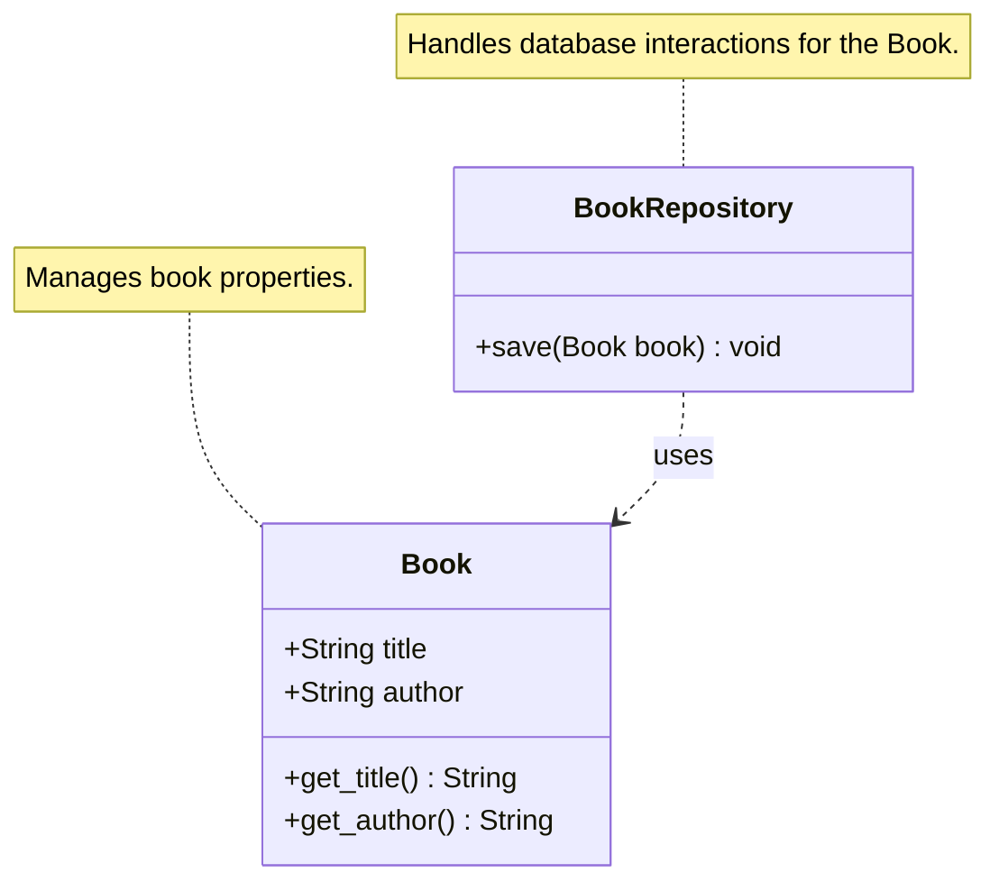
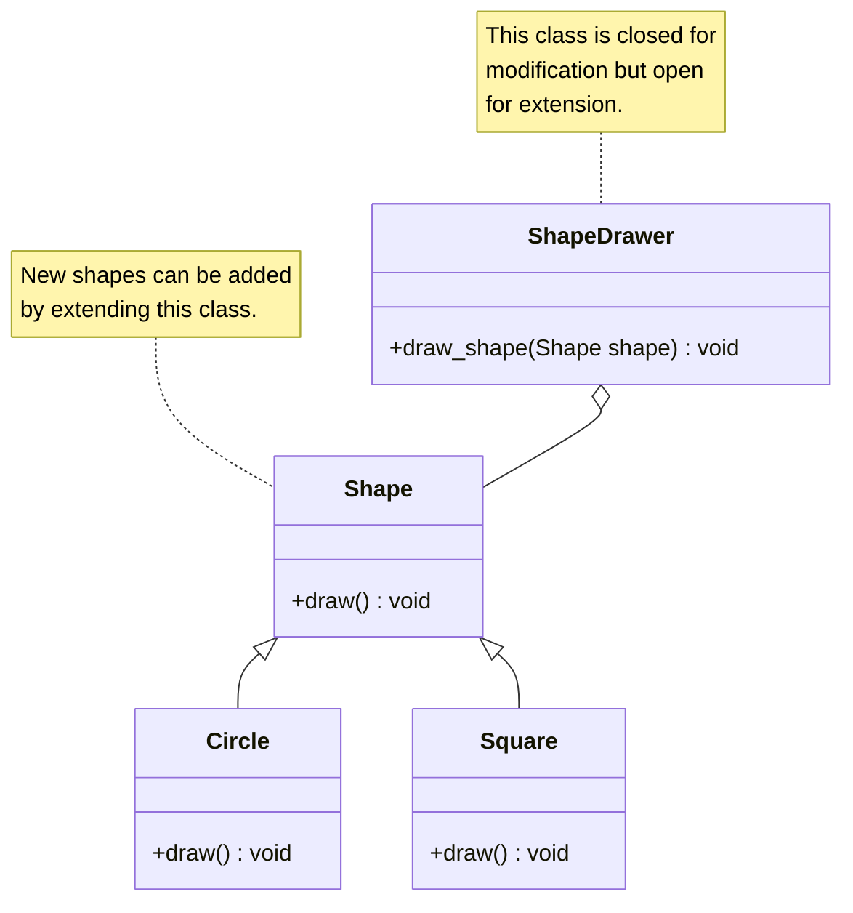
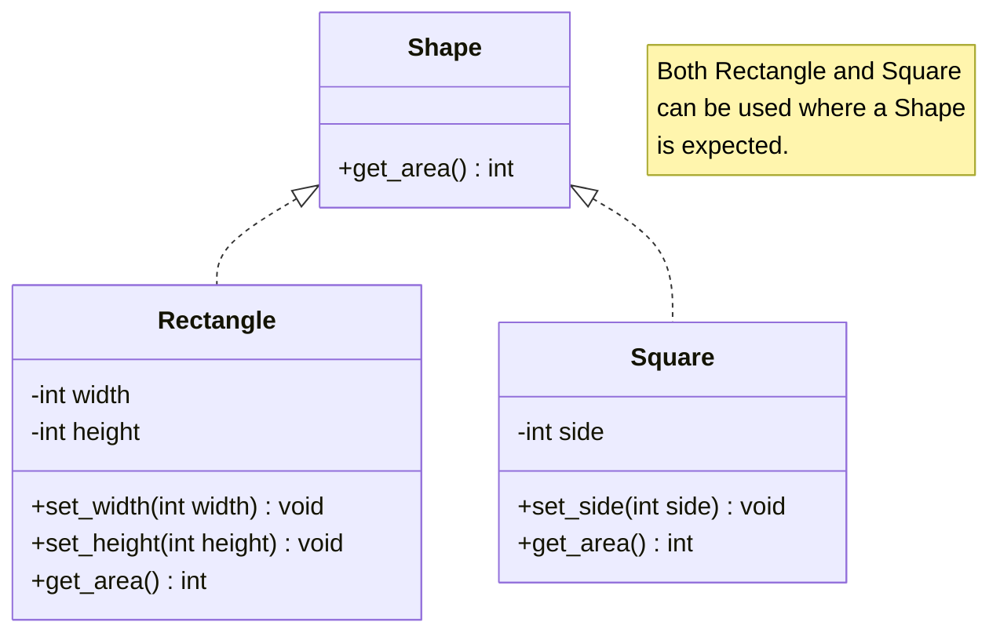
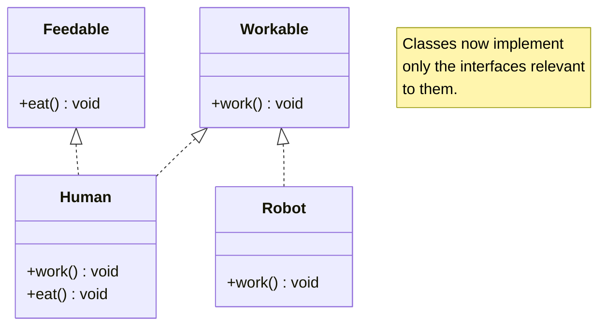
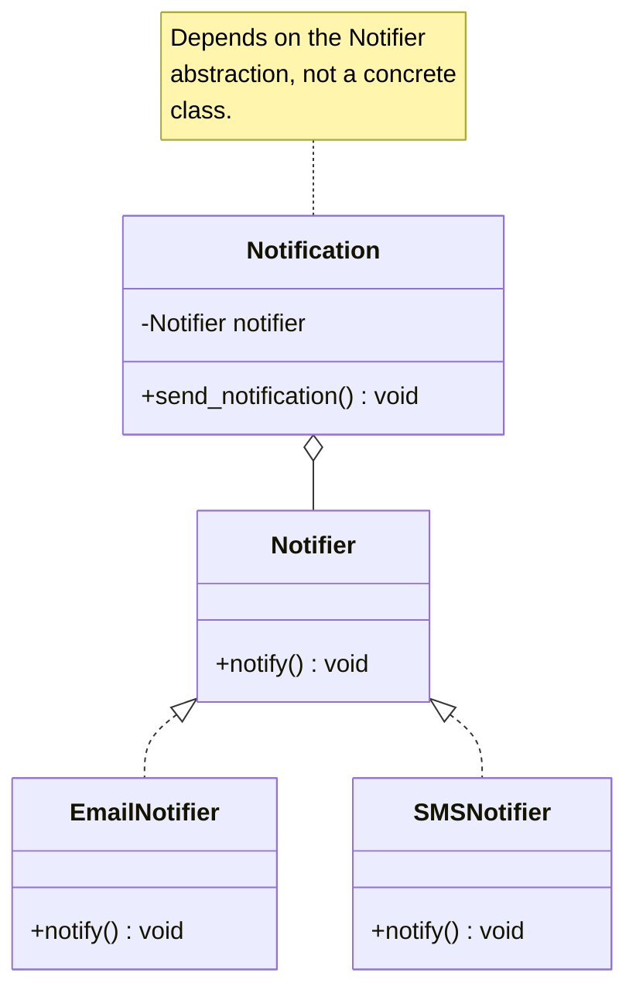

### Single Responsibility Principle

```mermaid
classDiagram
    class Book {
        +String title
        +String author
        +get_title() String
        +get_author() String
    }

    class BookRepository {
        +save(Book book) void
    }

    BookRepository ..> Book : uses

    note for Book "Manages book properties."
    note for BookRepository "Handles database interactions for the Book."
```

### Open/Closed Principle

```mermaid
classDiagram
    class ShapeDrawer {
        +draw_shape(Shape shape) void
    }
    class Shape {
        +draw() void
    }
    class Circle {
        +draw() void
    }
    class Square {
        +draw() void
    }

    Shape <|-- Circle
    Shape <|-- Square
    ShapeDrawer o-- Shape

    note for Shape "New shapes can be added<br/>by extending this class."
    note for ShapeDrawer "This class is closed for<br/>modification but open<br/>for extension."
```

### Liskov Substitution Principle

```mermaid
classDiagram
    class Shape {
        +get_area() int
    }
    class Rectangle {
        -int width
        -int height
        +set_width(int width) void
        +set_height(int height) void
        +get_area() int
    }
    class Square {
        -int side
        +set_side(int side) void
        +get_area() int
    }

    Shape <|.. Rectangle
    Shape <|.. Square

    note "Both Rectangle and Square<br/>can be used where a Shape<br/>is expected."
```

### Interface Segregation Principle

```mermaid
classDiagram
    class Workable {
        +work() void
    }
    class Feedable {
        +eat() void
    }
    class Human {
        +work() void
        +eat() void
    }
    class Robot {
        +work() void
    }

    Workable <|.. Human
    Feedable <|.. Human
    Workable <|.. Robot
    note "Classes now implement<br/>only the interfaces relevant<br/>to them."
```

### Dependency Inversion Principle

```mermaid
classDiagram
    class Notification {
        -Notifier notifier
        +send_notification() void
    }
    class Notifier {
        +notify() void
    }
    class EmailNotifier {
        +notify() void
    }
    class SMSNotifier {
        +notify() void
    }

    Notifier <|.. EmailNotifier
    Notifier <|.. SMSNotifier
    Notification o-- Notifier

    note for Notification "Depends on the Notifier<br/>abstraction, not a concrete<br/>class."
```
