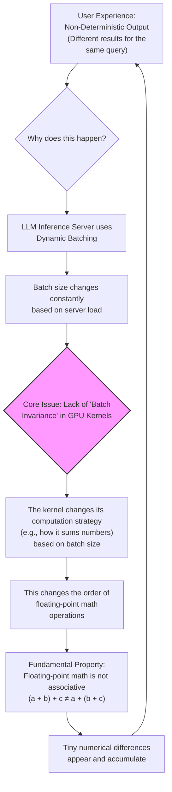
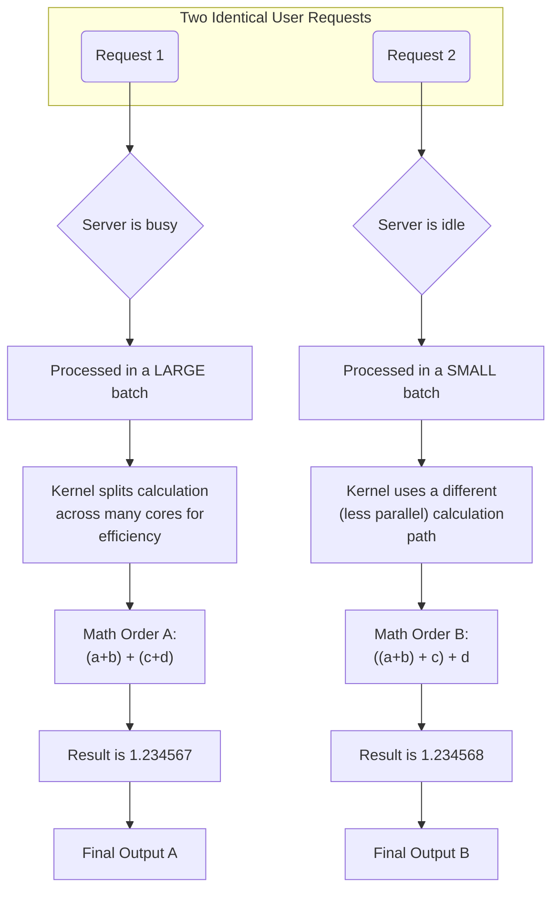
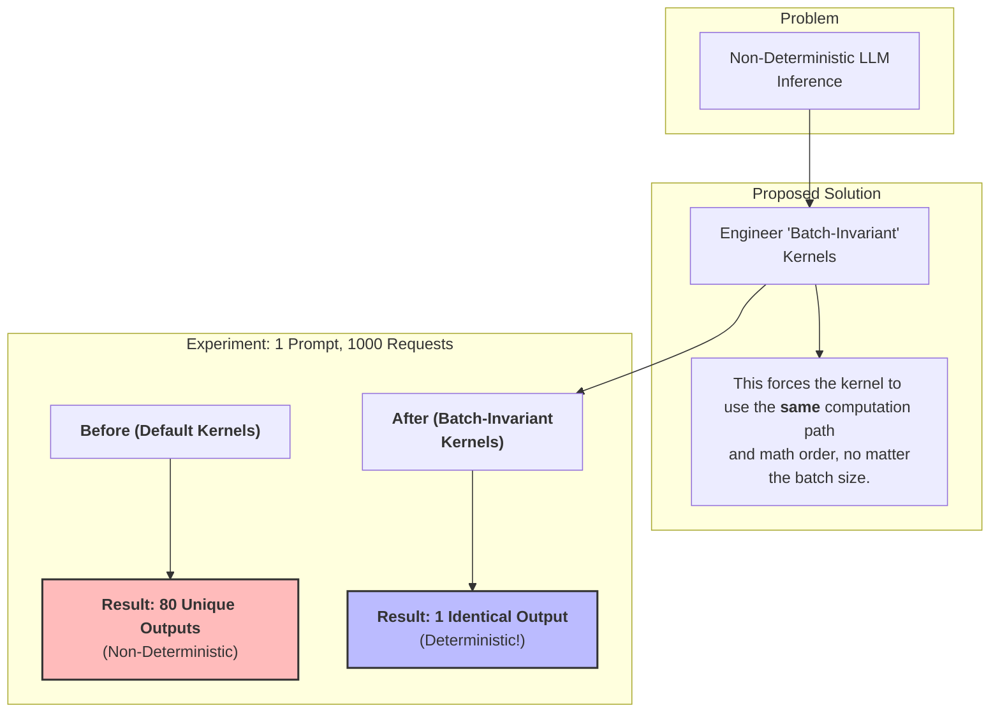

### The Root Cause of Non-Determinism

### How Different Batch Sizes Lead to Different Outputs

### The Solution and Experimental Proof

Source: [Defeating Nondeterminism in LLM Inference](https://thinkingmachines.ai/blog/defeating-nondeterminism-in-llm-inference/)
