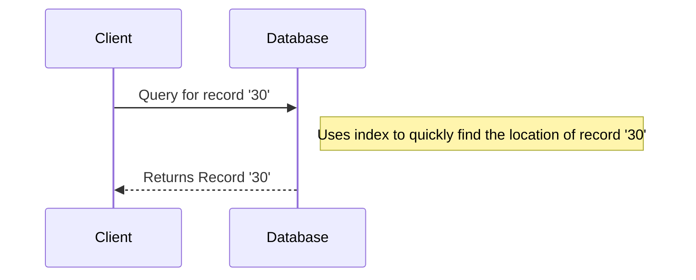
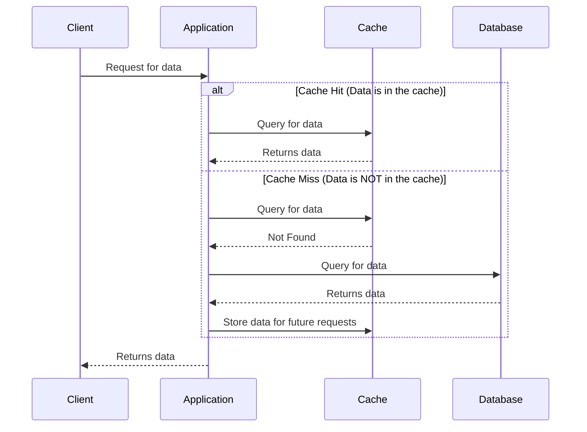
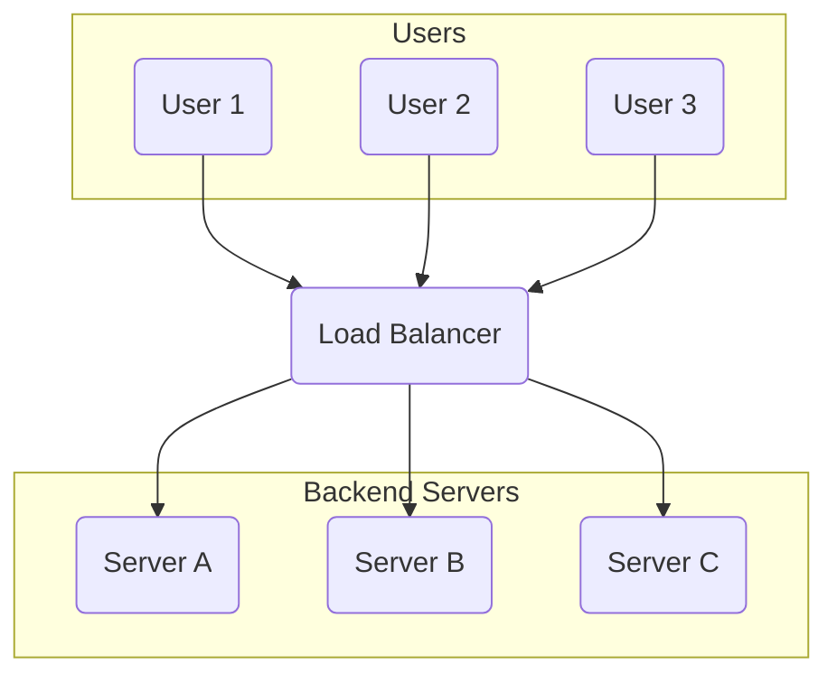
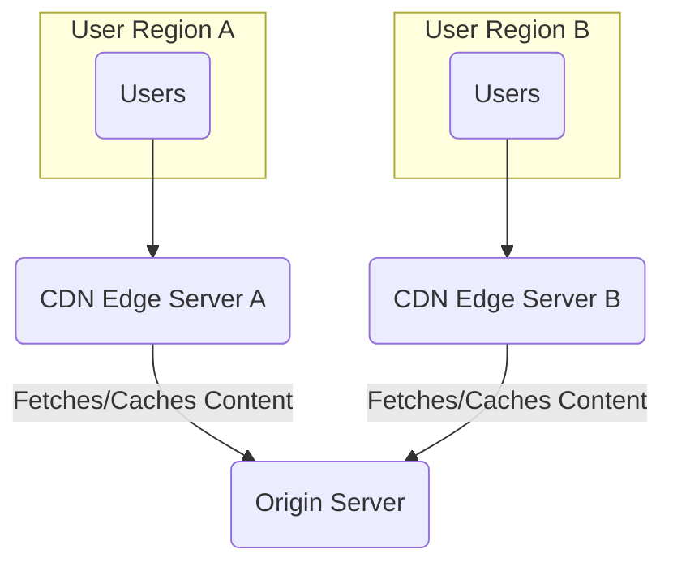
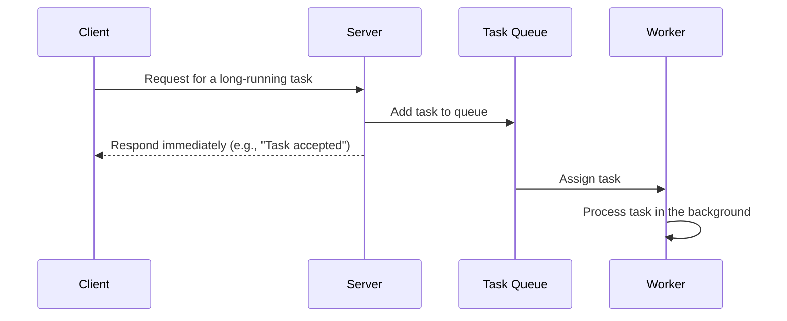
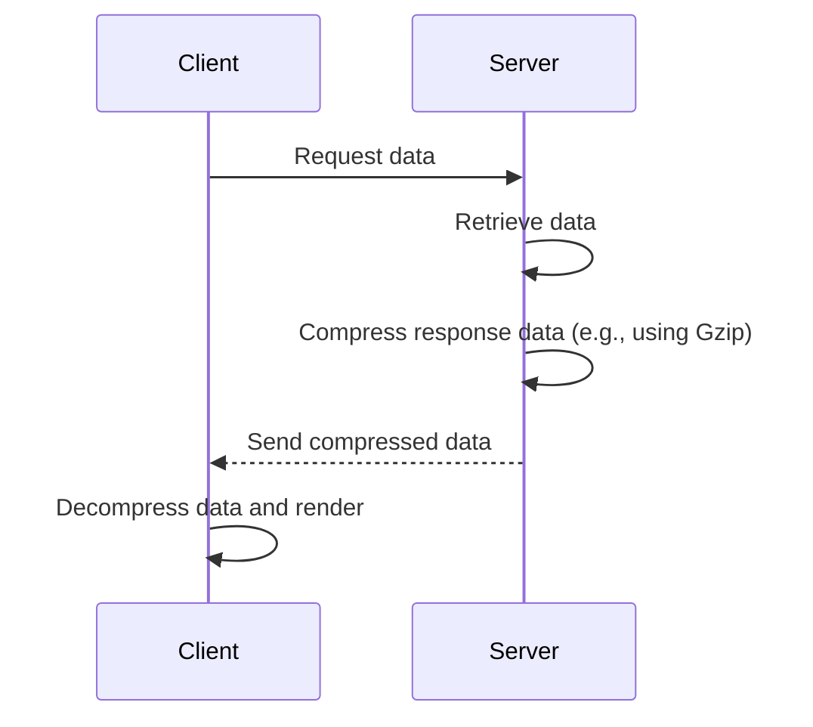

### Database Indexing

```mermaid
sequenceDiagram
    participant Client
    participant Database

    Client->>Database: Query for record '30'
    Note right of Database: Uses index to quickly find the location of record '30'
    Database-->>Client: Returns Record '30' 
```

### Caching

```mermaid
sequenceDiagram
    participant Client
    participant Application
    participant Cache
    participant Database

    Client->>Application: Request for data

    alt Cache Hit (Data is in the cache)
        Application->>Cache: Query for data
        Cache-->>Application: Returns data
    else Cache Miss (Data is NOT in the cache)
        Application->>Cache: Query for data
        Cache-->>Application: Not Found
        Application->>Database: Query for data
        Database-->>Application: Returns data
        Application->>Cache: Store data for future requests
    end

    Application-->>Client: Returns data
```

### Load Balancing

```mermaid
graph TD
    subgraph Users
        U1(User 1)
        U2(User 2)
        U3(User 3)
    end

    subgraph Backend Servers
        S1(Server A)
        S2(Server B)
        S3(Server C)
    end

    LB(Load Balancer)

    U1 --> LB
    U2 --> LB
    U3 --> LB

    LB --> S1
    LB --> S2
    LB --> S3
```

### Content Delivery Network (CDN)

```mermaid
graph TD
    subgraph "User Region A"
        UserA(Users)
    end
    subgraph "User Region B"
        UserB(Users)
    end

    OS(Origin Server)

    CDNA(CDN Edge Server A)
    CDNB(CDN Edge Server B)

    UserA --> CDNA;
    UserB --> CDNB;

    CDNA -- Fetches/Caches Content --> OS;
    CDNB -- Fetches/Caches Content --> OS;
```

### Asynchronous Processing

```mermaid
sequenceDiagram
    participant Client
    participant Server
    participant MessageQueue as Task Queue
    participant Worker

    Client->>Server: Request for a long-running task
    Server->>MessageQueue: Add task to queue
    Server-->>Client: Respond immediately (e.g., "Task accepted")
    MessageQueue->>Worker: Assign task
    Worker->>Worker: Process task in the background
```

### Data Compression

```mermaid
sequenceDiagram
    participant Client
    participant Server

    Client->>Server: Request data
    Server->>Server: Retrieve data
    Server->>Server: Compress response data (e.g., using Gzip)
    Server-->>Client: Send compressed data
    Client->>Client: Decompress data and render
```
