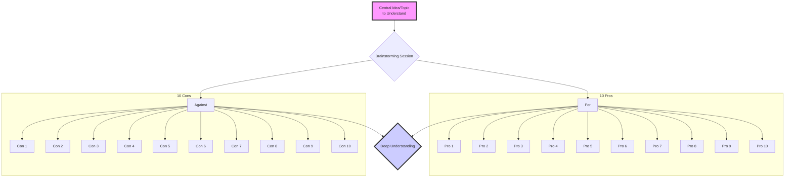

```mermaid
graph TD
    A[Central Idea/Topic <br/>to Understand] --> B{Brainstorming Session};
    B --> C[For];
    B --> D[Against];

    subgraph 10 Pros
        C --> C1[Pro 1];
        C --> C2[Pro 2];
        C --> C3[Pro 3];
        C --> C4[Pro 4];
        C --> C5[Pro 5];
        C --> C6[Pro 6];
        C --> C7[Pro 7];
        C --> C8[Pro 8];
        C --> C9[Pro 9];
        C --> C10[Pro 10];
    end

    subgraph 10 Cons
        D --> D1[Con 1];
        D --> D2[Con 2];
        D --> D3[Con 3];
        D --> D4[Con 4];
        D --> D5[Con 5];
        D --> D6[Con 6];
        D --> D7[Con 7];
        D --> D8[Con 8];
        D --> D9[Con 9];
        D --> D10[Con 10];
    end

    %% Refined Connections %%
    C --> E{Deep Understanding};
    D --> E;

    style A fill:#f9f,stroke:#333,stroke-width:4px
    style E fill:#ccf,stroke:#333,stroke-width:4px
```
