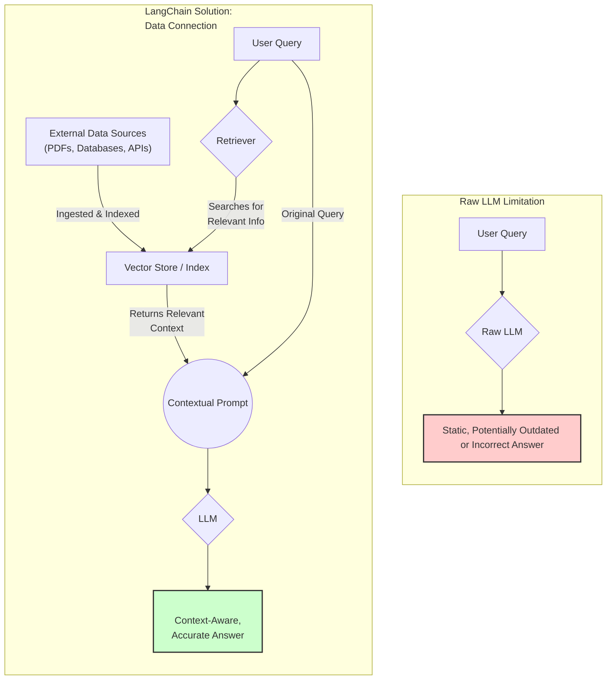
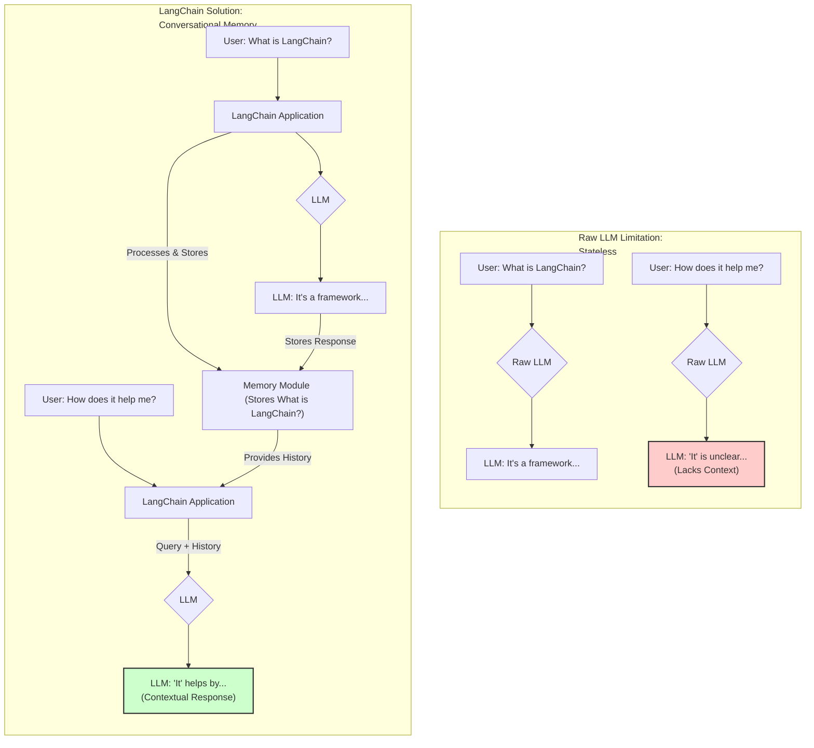
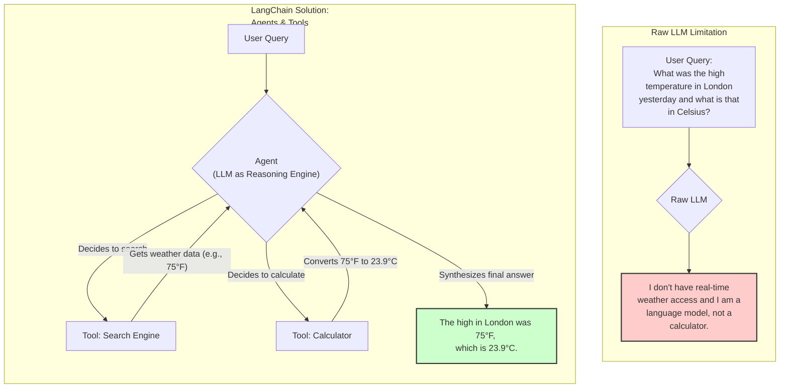

```mermaid
graph TB
    subgraph Raw LLM Limitation
        direction TB
        A[User Query] --> B{Raw LLM};
        B --> C["Static, Potentially Outdated or Incorrect Answer"];
    end

    subgraph "LangChain Solution: <br/>Data Connection"
        direction TB
        D[User Query] --> E{Retriever};
        F["External Data Sources <br/>(PDFs, Databases, APIs)"] -- Ingested & Indexed --> G[Vector Store / Index];
        E -- "Searches for <br/>Relevant Info" --> G;
        G -- "Returns Relevant <br/>Context" --> H((Contextual Prompt));
        D -- "Original Query" --> H;
        H --> I{LLM};
        I --> J["<br/>Context-Aware, <br/>Accurate Answer"];
    end

    style C fill:#ffcccc,stroke:#333,stroke-width:2px
    style J fill:#ccffcc,stroke:#333,stroke-width:2px
```

```mermaid
graph TB
    subgraph "Raw LLM Limitation: <br/>Stateless"
        direction TB
        U1[User: What is LangChain?] --> LLM1{Raw LLM};
        LLM1 --> R1[LLM: It's a framework...];
        U2[User: How does it help me?] --> LLM2{Raw LLM};
        LLM2 --> R2["LLM: 'It' is unclear... <br/>(Lacks Context)"];
    end

    subgraph "LangChain Solution: <br/>Conversational Memory"
        direction TB
        U3[User: What is LangChain?] --> Chain1[LangChain Application];
        Chain1 -- "Processes & Stores" --> Memory1["Memory Module <br/>(Stores What is LangChain?)"];
        Chain1 --> LLM3{LLM};
        LLM3 --> R3[LLM: It's a framework...];
        R3 -- "Stores Response" --> Memory1;
        U4[User: How does it help me?] --> Chain2[LangChain Application];
        Memory1 -- "Provides History" --> Chain2;
        Chain2 -- "Query + History" --> LLM4{LLM};
        LLM4 --> R4["LLM: 'It' helps by... <br/>(Contextual Response)"];
    end

    style R2 fill:#ffcccc,stroke:#333,stroke-width:2px
    style R4 fill:#ccffcc,stroke:#333,stroke-width:2px
```

```mermaid
graph TB
    subgraph Raw LLM Limitation
        direction TB
        A["User Query:<br/>What was the high<br/>temperature in London<br/>yesterday and what is that<br/>in Celsius?"] --> B{Raw LLM};
        B --> C["I don't have real-time <br/> weather access and I am a <br/> language model, not a <br/> calculator."];
    end

    subgraph "LangChain Solution: <br/>Agents & Tools"
        direction TB
        D[User Query] --> E{"Agent <br/>(LLM as Reasoning Engine)"};
        E -- "Decides to search" --> F[Tool: Search Engine];
        F -- "Gets weather data (e.g., 75°F)" --> E;
        E -- "Decides to calculate" --> G[Tool: Calculator];
        G -- "Converts 75°F to 23.9°C" --> E;
        E -- "Synthesizes final answer" --> H["The high in London was 75°F, <br/>which is 23.9°C."];
    end

    style C fill:#ffcccc,stroke:#333,stroke-width:2px
    style H fill:#ccffcc,stroke:#333,stroke-width:2px
```
