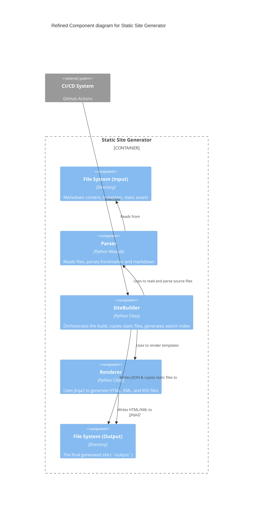
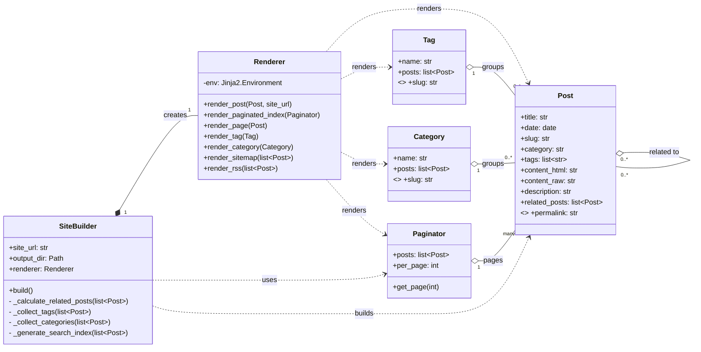
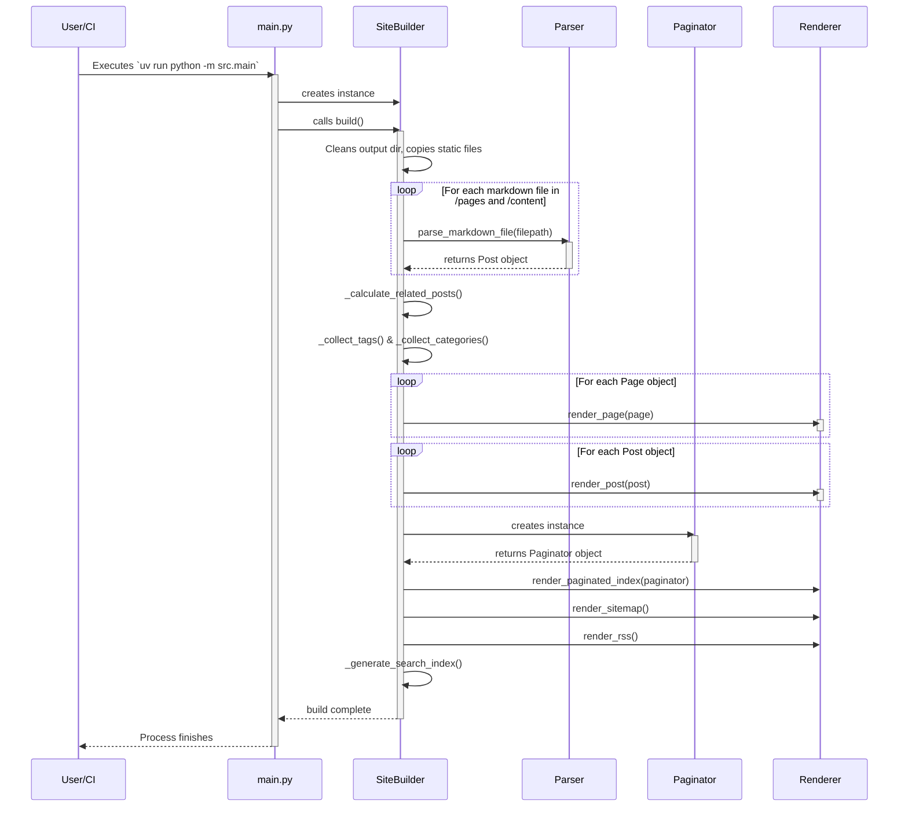
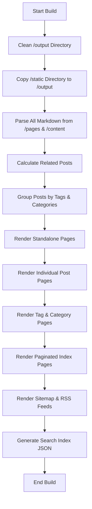
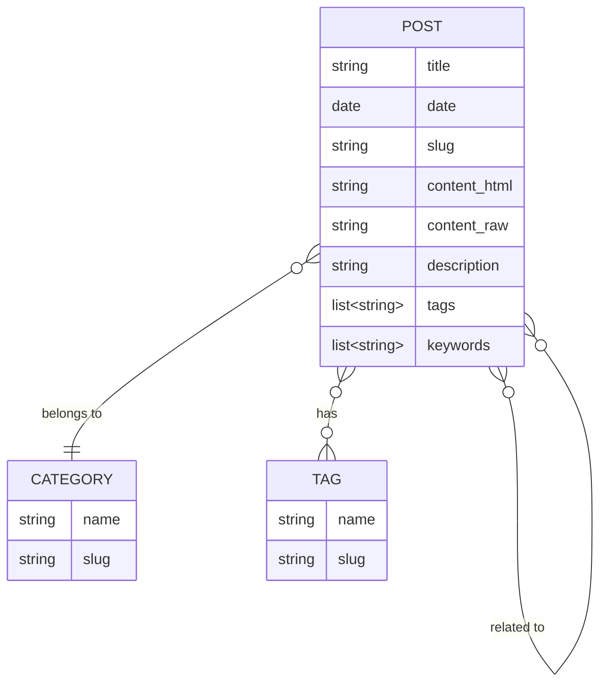
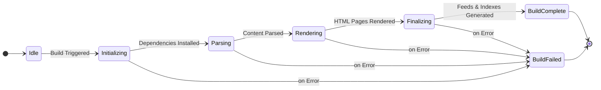
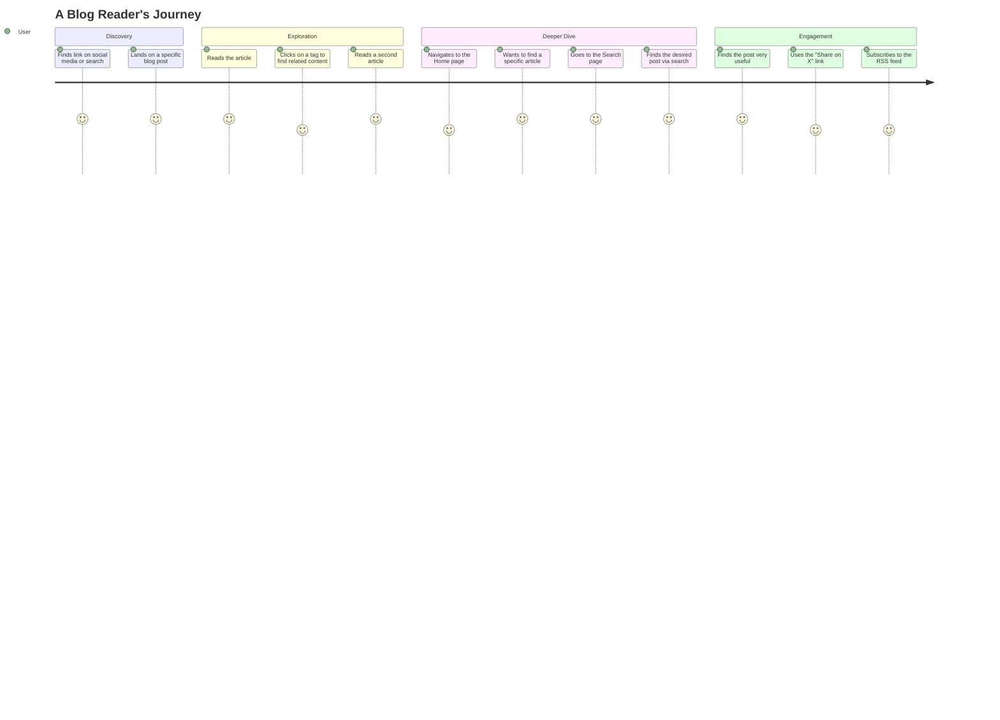

# Project Design and Architecture

This document outlines the architecture, processes, and user flows of the static site generator and the resulting blog. All diagrams are generated using Mermaid.

## Table of Contents
1.  [C4 Component Diagram](#1-c4-component-diagram)
2.  [Class Diagram](#2-class-diagram)
3.  [Sequence Diagram (Build Process)](#3-sequence-diagram-build-process)
4.  [Flowchart (Build Logic)](#4-flowchart-build-logic)
5.  [Entity Relationship Diagram](#5-entity-relationship-diagram)
6.  [State Diagram (Build State)](#6-state-diagram-build-state)
7.  [User Journey Map](#7-user-journey-map)

---

### 1. C4 Component Diagram

This diagram provides a high-level overview of the major components *within* the Static Site Generator system and how they interact during the build process.

### 2. Class Diagram

This diagram shows the primary Python classes in the `src` directory, their attributes, methods, and relationships. It details the object-oriented structure of the application.

### 3. Sequence Diagram (Build Process)

This diagram illustrates the sequence of interactions between the different components when the `uv run python -m src.main` command is executed.

### 4. Flowchart (Build Logic)

While the Sequence Diagram shows object interaction, this flowchart provides a clearer view of the logical flow and decision-making within the `build()` method itself.

### 5. Entity Relationship Diagram

The ERD focuses solely on the data model, illustrating the relationships between the core content entities.

### 6. State Diagram (Build State)

This diagram models the different states of the build process from the moment it is triggered until it completes or fails.

### 7. User Journey Map

This diagram visualizes a typical user's experience interacting with the final, deployed blog, from discovery to engagement.

